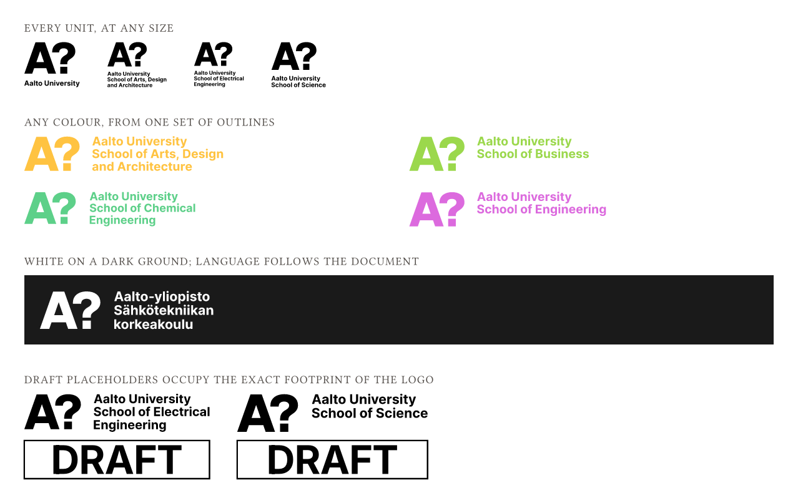

# aalto-logo

Aalto University's logos for [Typst](https://typst.app) — every unit, language,
size and mark, drawn as native Typst curves.

Because the logos are curves rather than images, they are resolution
independent, scale to any size from a single data file, and take **any Typst
colour** — not just the black and white the official artwork ships in.



## Install

The package is not on Typst Universe yet. Install it locally:

```sh
make install-local
```

That symlinks the repository into
`${XDG_DATA_HOME:-$HOME/.local/share}/typst/packages/local/aalto-logo/0.1.0`,
after which any document can import it:

```typ
#import "@local/aalto-logo:0.1.0": aalto-logo, aalto-color
```

With Nix, `nix develop` gives you a shell with `typst` and the pipeline's
dependencies, with `TYPST_PACKAGE_PATH` already pointing at a built copy of the
package — no install step needed.

Once the package is published, the import becomes
`#import "@preview/aalto-logo:0.1.0": aalto-logo, aalto-color`.

## Usage

```typ
#import "@local/aalto-logo:0.1.0": aalto-logo

#aalto-logo(unit: "ELEC", height: 40pt)
```

### `aalto-logo()`

| Parameter | Default | Values |
| --- | --- | --- |
| `unit` | `"Aalto"` | `"Aalto"`, `"ARTS"`, `"ELEC"`, `"SCI"`, `"ENG"`, `"CHEM"`, `"BIZ"` |
| `language` | `"auto"` | `"en"`, `"fi"`, `"se"`, `"fi-se-en"` (Aalto unit only), or `"auto"` |
| `size` | `"small"` | `"large"`, `"small"` |
| `color` | `"black"` | `"black"`, `"white"`, or any Typst colour |
| `mark` | `"question"` | `"question"`, `"quote"`, `"exclamation"` |
| `height` | `auto` | any length |
| `width` | `auto` | any length |
| `draft` | `false` | `true` draws a same-sized `DRAFT` placeholder instead |
| `font` | `"Inter"` | font preference for the draft stamp, or `auto` to inherit |

`size` selects between the two official lockups: `"large"` stacks the wordmark
under the mark, `"small"` sets it beside.

Sizing follows the usual Typst convention: give `height` **or** `width` and the
other is derived from the logo's native aspect ratio. Give neither and the logo
falls back to a height of `25pt`. Give both and the logo is stretched to fit.

### `aalto-color()`

```typ
#aalto-color(unit: "ARTS")   // the school's own colour
#aalto-color("red")          // an Aalto style-guide colour
```

With a `unit:` other than `"Aalto"`, returns that school's identity colour. For
`unit: "Aalto"` (the default) the positional argument picks a style-guide
colour: `"red"` (the default), `"yellow"`, `"blue"`, or `"gray"`. Note that
`"gray"` is a convenience, not an official style-guide colour.

## Examples

Every school, at a fixed height:

```typ
#for unit in ("Aalto", "ARTS", "BIZ", "CHEM", "ELEC", "ENG", "SCI") {
  box(aalto-logo(unit: unit, language: "en", size: "large", height: 30pt))
  h(6pt)
}
```

Recoloured, and reversed out of a dark ground:

```typ
#aalto-logo(unit: "ENG", height: 22pt, color: aalto-color(unit: "ENG"))

#block(fill: rgb("1a1a1a"), inset: 8pt)[
  #aalto-logo(unit: "CHEM", height: 22pt, color: "white")
]
```

Draft placeholders, for documents you must not circulate under the real mark:

```typ
#aalto-logo(unit: "ELEC", height: 26pt, draft: true)
```

The placeholder is drawn natively — no asset, and it takes the same colour as
the real logos. It occupies **exactly** the footprint of the logo it replaces,
so toggling `draft` never reflows the document.

A title page, sized by width:

```typ
#set text(lang: "fi")
#align(center, aalto-logo(unit: "SCI", size: "large", width: 60mm))
```

## Notes and caveats

- **Language auto-detection** follows `text.lang`, so setting the document
  language selects the right logo. Anything other than `en`, `fi` or `se` falls
  back to `en`. `"fi-se-en"` is not a valid `text.lang` code and must always be
  passed explicitly.
- **The small single-language Aalto University logo has been decommissioned.**
  Asking for it is an error; use `language: "fi-se-en"` or `size: "large"`.
- **The draft stamp** prefers Inter and appends the document's own font
  families as a fallback. Typst warns once per use for every family it cannot
  find, with no way to suppress it
  ([typst#6010](https://github.com/typst/typst/issues/6010)); pass `font: auto`
  to inherit the document's fonts and name nothing, which keeps the compile
  silent.
- **Colours are applied at compile time** to a single set of outlines. The black
  and white official artwork is geometrically identical — the build verifies
  this per logo — so only one set is shipped.
- Requires Typst 0.13 or newer, for `curve()` and its `fill-rule`.

## Trademark and brand usage

This package is not affiliated with, endorsed by, or published by Aalto
University.

The MIT licence in [LICENSE](LICENSE) covers the code in this repository. It
does not grant any right in Aalto University's brand. The Aalto name, the
university and school logos, and the artwork the curve data is derived from
belong to Aalto University, and their use is governed by the university's own
brand guidelines. Before putting these logos in anything you publish, check that
your use complies:

- <https://www.aalto.fi/en/aalto-university/aalto-university-brand>
- <https://aaltologo.fi>

## Regenerating the logo data

The files in `logos/` are generated; do not edit them by hand. The pipeline
needs `mutool` (from MuPDF), Python with Pillow, and `typst` — all provided by
`nix develop`.

```sh
python3 download_logos.py --format both   # fetch sources/pdf and sources/png
python3 build_vectors.py                  # sources/pdf -> logos/*.typ
python3 tests/compare_render.py           # pixel-diff the curves against the PNGs
```

`build_vectors.py` converts each vector PDF to SVG with `mutool`, flattens the
paths, and normalises the coordinates into ratios of the artwork's bounding box,
so drawing the data inside a `box()` of any size scales it exactly. It also
verifies that the white artwork matches the black geometry before dropping the
colour axis.

`sources/` is build input and is not shipped, nor committed. See `make help` for
the rest of the targets.

## Licence

MIT — see [LICENSE](LICENSE), including its trademark notice.
